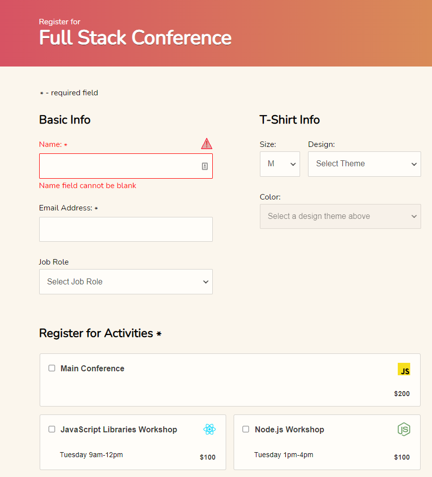

# Interactive Form

An HTML/JavaScript site containing a sign-up form for a developer conference.

A live demo can be found [here](https://jimjitsuesq.github.io/portfolio-interactive-form/).

## Table of Contents

* [General Info](#general-information)
* [Technologies Used](#technologies-used)
* [Features](#features)
* [Screenshots](#screenshots)
* [Contact](#contact)

## General Information

- This was the third project in my Team Treehouse Full-Stack JavaScript Tech Degree.
- I received grade of "Exceeds Expectations" (the highest available).
- The main focuses of this project included building form elements, data validation and practicing regular expressions.

## Technologies Used

- JavaScript
- HTML
- CSS

## Features

- Real-time validation

## Screenshots

## Contact

Created by [@jimjitsuesq](https://www.jimpeters.dev/).  Feel free to contact me!
